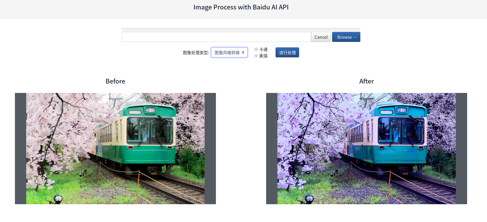

# Image process with Baidu AI

## 如何使用

1. 克隆该项目
```shell script
git clone https://github.com/busyboxs/image-process-flask.git
```
2. 安装依赖库
```shell script
pip install requirements.txt
```
3. 在百度大脑 AI 开放平台的 [控制台](https://console.bce.baidu.com/?fromai=1#/aip/overview) 创建图像处理应用，获取对应应用的 `API Key` 和 `Secret Key`；
4. 将第二步获取的 `API Key` 和 `Secret Key` 的内容复制粘贴到 `image_process.py` 中；

5. 执行 `run.py`，然后浏览器打开 [http://127.0.0.1:5000/](http://127.0.0.1:5000/ )

